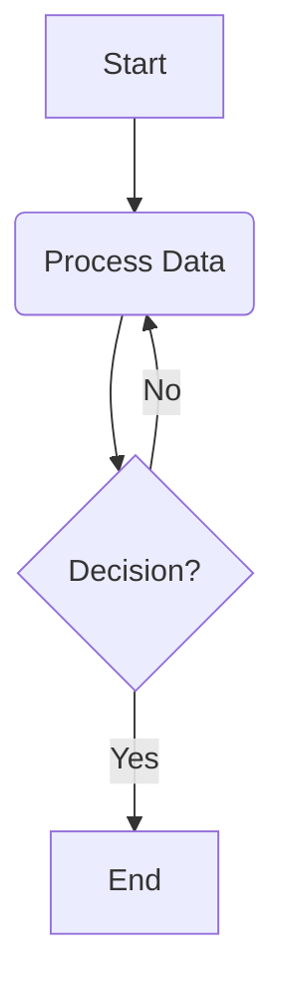

# Welcome to the documentation for **My Project**!

This project is a template designed to get you up and running quickly with a versatile Python application. It includes a customizable core library and showcases examples for a FastAPI web service, a Typer CLI, and a data pipeline script.

## Overview

Provide a brief overview of your project here. What does it do? Who is it for?

## Using This Documentation

This site provides an overview of the project structure, setup instructions, and guides for various components.

### Example: Admonitions

The Material for MkDocs theme supports various admonition types to highlight information:

!!! note
    This is a note. Useful for general information.

!!! tip "Pro Tip"
    This is a tip. Great for helpful hints!

!!! warning
    This is a warning. Use this for critical alerts or potential issues.

!!! danger "Danger Zone"
    This is for very important warnings.

### Example: Code Blocks

Syntax highlighting for various languages is supported:

```python
# Example Python code
def hello_world():
    print("Hello, from your project!")

hello_world()
```

```bash
# Example Bash command
echo "Running a command..."
task list
```

### Mermaid Diagrams

You can also embed Mermaid diagrams:



## Getting Started

Link to installation, configuration, or quick start guides.

- See [Installation](./installation.md) (You'll need to create this file)
- Check out the [Usage Guide](./usage.md) (You'll need to create this file)

## Core Library

Details about `your_core_library`.

## Example Applications

This template includes several examples to demonstrate its capabilities:
- A **FastAPI web application** (`examples/web/`) for building APIs.
- A **Typer CLI application** (`examples/cli.py`) for command-line tools.
- A **Data Pipeline script** (`examples/data_pipeline.py`) for ETL-like processes.

These examples utilize the core library and can be customized or removed as needed.

## Next Steps

- Explore the **Guides** section for detailed information on specific topics like container registries or security.
- Check out the main project [README.md](https://github.com/{{YOUR_GITHUB_USERNAME}}/{{YOUR_PROJECT_NAME}}) on GitHub for overall project setup and usage.

## Contributing

If you'd like to contribute, please see the [Contributing Guidelines](https://github.com/{{GITHUB_USERNAME}}/{{PROJECT_SLUG}}/blob/main/CONTRIBUTING.md).
